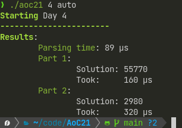

# Advent of Code 2024

)

> ⚠️ This README is copied from my previous years solution. It is not fully adopted to 2024 yet.

Last Years README:
> This is the third year in a row I (plan to) use rust to solve Advent of Code. But I must warn you: I haven't programmed a lot over the past year, so I am likely not in the best shape (School has been rough - I need a break) - expect the worst.
> Just like last year, I am lazy and currently setting this project up in a hurry (In class, actually) just so I have the basic framework once the event starts. So this project is literally a cleaned-up copy of my [solutions for the previous year](https://github.com/LeMoonStar/AoC22), which in term are a cleaned up version of my [Advent of Code 2021 solutions](https://github.com/LeMoonStar/AoC21).  
> **The Following therefore still contains screenshots of the 2021 binary. The usage is the same, but the name is `aoc24` instead of `aoc21`**
> 
> Later on, maybe even before AoC starts, I'll clean this up more, maybe create a crate out of the framework so I don't have to copy each year over and over again.

Well, not much changed. This is now the fourth year I'll use Rust - after not using Rust in a while and likely with a lot less time at hand. We'll see how it goes. I am finally out of school tough - that's a relief!

## Usage

There are multiple ways to run my solutions, the easiest and most comfortable one is the `auto` command:  
It automatically downloads your input. For this it requires you to provide your Advent of Code session id, which you can find in the websites cookies after logging in.  
Simply provide the session token by setting the `AOC_SESSION` environment variable or using the -s argument:  
`AOC_SESSION=XXXMYSESSION ./aoc24 [DAY] auto` or `./aoc24 [DAY] auto -s XXXMYSESSION`.  
In this example, the environment variable for the AoC session is set using `export AOC_SESSION=XXXMYSESSION`, so I can run the command without specifying the session token again:  
  

If you don't want to automatically download the input, you can also use the `run` command, which uses a locally stored file or the stdin input:  
`./aoc24 [DAY] run -f my_input.txt`:  
  

If you just want to run the day's example, simply use the `test` command, as this project already includes the examples:
`./aoc24 [DAY] test`:  
  

## Compiling

This project uses `Cargo`, so compiling is pretty easy:  
`cargo build --release`  
The resulting binary can be found at `./targets/release/aoc22`. You can also directly run the project using `cargo run --release [arguments for aoc24]`  
the `--release` option is not required, but it results in better performance.

## Check out other AoC24 solutions

| Repository                                                                       | Language |
|----------------------------------------------------------------------------------|----------|
| [Trojaner's AdventofCode2024](https://github.com/TrojanerHD/AdventofCode2024)    | Rust     |
| [Niklas' Advent-of-Code-2024](https://github.com/derNiklaas/Advent-of-Code-2024) | Kotlin   |
